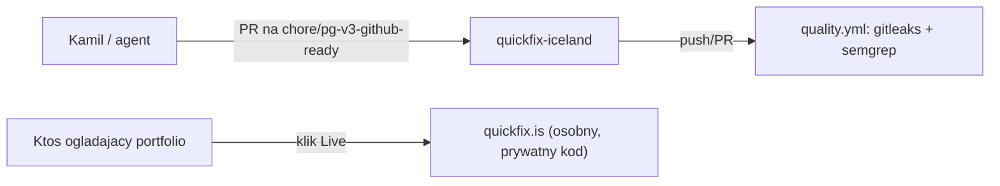

# ARCHITECTURE — quickfix-iceland

## Co to jest (3 zdania)

Ten depozytorium NIE zawiera aplikacji — to publiczna wizytówka/referencja dla serwisu
QuickFix (usługi hydraulika/złota rączka, Reykjavík), którego kod źródłowy jest prywatny.
Płaci/korzysta właściciel biznesu QuickFix; repo istnieje, żeby portfolio/audyt mogły
wskazać na coś konkretnego bez ujawniania kodu, cen czy danych klientów.

## Stack tego repo (nie produktu)

Zero zależności. Same pliki Markdown + workflow GitHub Actions:

| Katalog/plik | Odpowiedzialność |
|---|---|
| `README.md` | co to jest, gdzie jest żywy produkt, status |
| `docs/ARCHITECTURE.md` | ten plik |
| `docs/adr/` | decyzje (dlaczego repo publiczne ≠ repo z kodem) |
| `docs/RUNBOOK.md` | jak sprawdzić, czy produkt żyje (curl, nie kod) |
| `docs/GLOSSARY.md` | słowniczek terminów użytych w tym repo |
| `.github/workflows/quality.yml` | skan sekretów + Semgrep na treści TEGO repo (kroki npm pomijają się — brak `package.json`) |

## Co wiadomo o żywym produkcie (publicznie, bez zaglądania w kod)

Z README produktu i strony `quickfix.is` (zweryfikowane `curl`, tytuł strony się zgadza):
strona marketingowa trójjęzyczna (EN/PL/IS), galeria przed/po, kontakt przez WhatsApp
(floating button), landing page z depozytem. Kod źródłowy żyje w osobnym repo
[`homehug-services`](https://github.com/kamiljan11/homehug-services) — ten agent go nie
otwierał (poza zakresem tego zadania), więc stack wdrożeniowy (framework, hosting, baza)
zostaje **[NIEPEWNE — nie widoczne z tego repo]**. Nie zgaduj tych szczegółów w audytach ani
ofertach — poproś Kamila o potwierdzenie, jeśli są potrzebne.

## Przepływ (to repo, nie produkt)

## Gdzie jest…

- **kod aplikacji**: nie w tym repo — w `homehug-services` (patrz README), poza zasięgiem tego audytu
- **dowod, ze produkt zyje**: `docs/RUNBOOK.md` (`curl -I https://quickfix.is`)
- **decyzja o rozdziale repo publiczne / kod prywatny**: `docs/adr/0001-public-repo-is-a-reference-not-the-source.md`

## Decyzje nieodwracalne

Lista ADR: `docs/adr/`.

## Jak to cofnąć / kill switch

Nie dotyczy — ten repo nie steruje niczym w produkcji, to wyłącznie dokumentacja.
